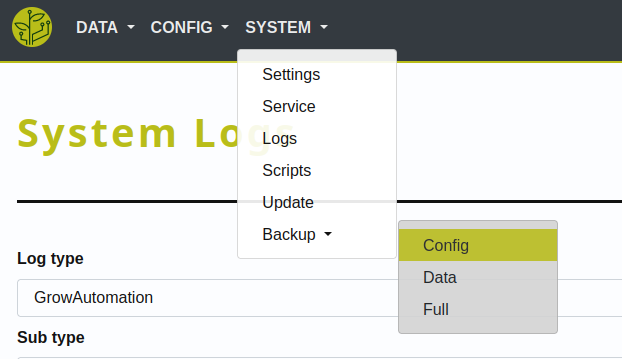

.. _basic-bugs:

.. include:: ../includes/tip_links.rst

====
Bugs
====

**When you encounter errors** you can check out our :ref:`troubleshooting guide <basic-troubleshoot>`.

If you could not resolve your problem by troubleshooting you can submit a bug ticket per email.

-----

Support
*******

The GrowAutomation software is an open source project.

Since we have limited time we cannot operate a basic technical support.

Therefore a community portal will be created to build a knowledge-base: `Community (not yet online) <https://community.growautomation.eu/>`_

**If you want to support our efforts** => consider `becoming a patreon <https://www.patreon.com/growautomation/>`_

-----

Bug hunting
***********

Before continuing => you need to know what's the source of the error. As described in the :ref:`troubleshooting guide <basic-troubleshoot>`.

Basic
=====

Note the following in the ticket email:

- What action did you perform as the error occurred? (*if any*)
- Export the current config and attach it to the issue/ticket:

  |system_export|

Core
====

Please prepare the following:

- Set your log-level to 6 or above like described in the :ref:`troubleshooting guide <basic-troubleshoot>`
- Try to re-create the error
- Copy the following logs each in a separate text file:

  - GrowAutomation - Core
  - Service - GrowAutomation
  - Service journal - GrowAutomation
  - GrowAutomation - DeviceX (*if device-logging is enabled and devices are affected*)

- Check if there are `existing issues/bugs <https://github.com/superstes/growautomation/issues>`_
- Open a new `GitHub issue <https://github.com/superstes/growautomation/issues/new>`_ and attach the logs/config-export to it

Web
===

Please prepare the following:

- Try to re-create the error
- Copy the following logs each in a separate text file:

  - GrowAutomation - Web
  - Service - Apache webserver
  - Service journal - Apache webserver

- Check if there are `existing issues/bugs <https://github.com/superstes/growautomation/issues>`_
- Open a new `GitHub issue <https://github.com/superstes/growautomation/issues/new>`_ and attach the logs/config-export to it
