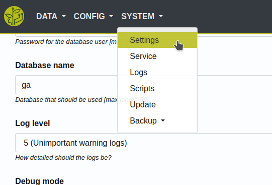

.. _basic-troubleshoot:

.. |django_error_404| image:: ../_static/img/basic/troubleshoot/django_error_404.png
   :class: ga-img-basic ga-img-border
.. |django_error_500| image:: ../_static/img/basic/troubleshoot/django_error_500.png
   :class: ga-img-basic ga-img-border
.. |service_failed| image:: ../_static/img/basic/troubleshoot/service_failed.png
   :class: ga-img-basic ga-img-border
.. |service_restart| image:: ../_static/img/basic/troubleshoot/service_restart.png
   :class: ga-img-basic ga-img-border
.. |log_service| image:: ../_static/img/basic/troubleshoot/log_service.png
   :class: ga-img-basic ga-img-border
.. |log_service_journal| image:: ../_static/img/basic/troubleshoot/log_service_journal.png
   :class: ga-img-basic ga-img-border
.. |log_app| image:: ../_static/img/basic/troubleshoot/log_app.png
   :class: ga-img-basic ga-img-border
.. |log_web| image:: ../_static/img/basic/troubleshoot/log_web.png
   :class: ga-img-basic ga-img-border
.. |controller_loglevel| image:: ../_static/img/basic/troubleshoot/controller_loglevel.png
   :class: ga-img-basic ga-img-border

.. |system_service| image:: ../_static/img/basic/troubleshoot/system_service.png
   :class: ga-img-basic ga-img-border
.. |system_log| image:: ../_static/img/basic/troubleshoot/system_log.png
   :class: ga-img-basic ga-img-border

.. include:: ../includes/tip_links.rst

============
Troubleshoot
============

Check
*****

Here's a little checklist of what to check when you run into errors.

First
=====

Check if your configuration meets the requirements as described in this documentation.

The config **WILL NOT** be check for sanity. Only for some common cases.

Therefore errors might occur if the config is not set as expected.

Second
======

Basic troubleshooting.

You could reach out to the community to get help with those basic problems: `Community (not yet online) <https://community.growautomation.eu/>`_

The problem might occur due to one of these components:

- your network
- the server (*raspberry/linux*)
- the basic software needed to run GrowAutomation (*database/webserver*)
- hardware like sensors or wiring

Best to divide and conquer. Test it step by step to find the point where it breaks.

Third
=====

Check the logs.

Identify
________

Next you need to identify the source of the error.

It is either the **web-interface** or the **application** itself.

Here are examples of how those errors look like.

Examples
^^^^^^^^

- **Web-interface**:

  |django_error_404|
  |django_error_500|

- **Application**:

  - Sensor data is missing
  - Actions are not performed as expected
  - The service often/always failing

    |service_failed|

When you identified the source => you can check its logs.

----

Logs
****

Level
=====

The main setting regarding logs is the log-level set in the controller settings:

|system_controller|

For troubleshooting you can up this log-level to 6 or above.

But you should revert it back to 1-3 for normal operation.

|controller_loglevel|

After changing it => you must restart the service to activate it.

|service_restart|

View
====

You can access the logs via the web-interface:

|system_log|

Here you can choose between multiple log types and sub-types.

Web
___

When the error occurred on the web-interface => you can check the web logs for errors.

|log_web|

App/Core
________

When the error occurred in the core application => you can check the core and device logs.

|log_app|

The core service has also

- a **service log**:

  |log_service|

- a **service journal log**:

  |log_service_journal|

Device
______

There is also an option for device-specific logging.

This can be dis-/enabled in the controller settings.

It might help troubleshoot device errors or debugging custom implemented devices.

----

Hardware
********

Hardware like sensors, actors of any kind and wiring can be troublesome.

There is no generic how-to that will fit any device.

Much of it is just experience with the explicit device.

Therefore we are documenting known issues and their solutions for some of the devices we use:

- :ref:`input device <device-input>`
- :ref:`output device <device-output>`
- :ref:`connection device <device-connection>`

We also want to create a clean way of wiring those devices to save troubles.

- :ref:`wiring <setup-wiring>`
