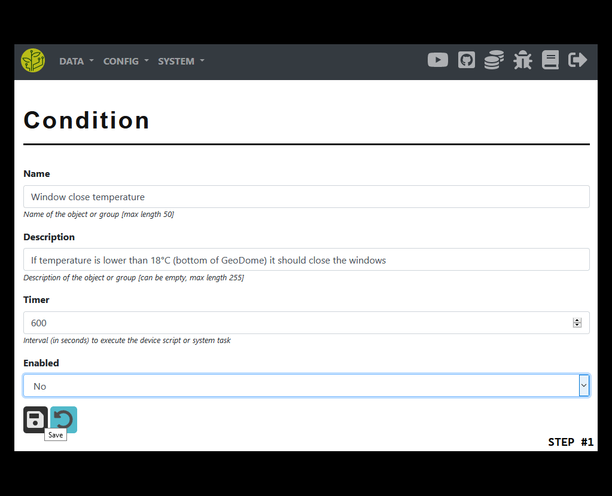
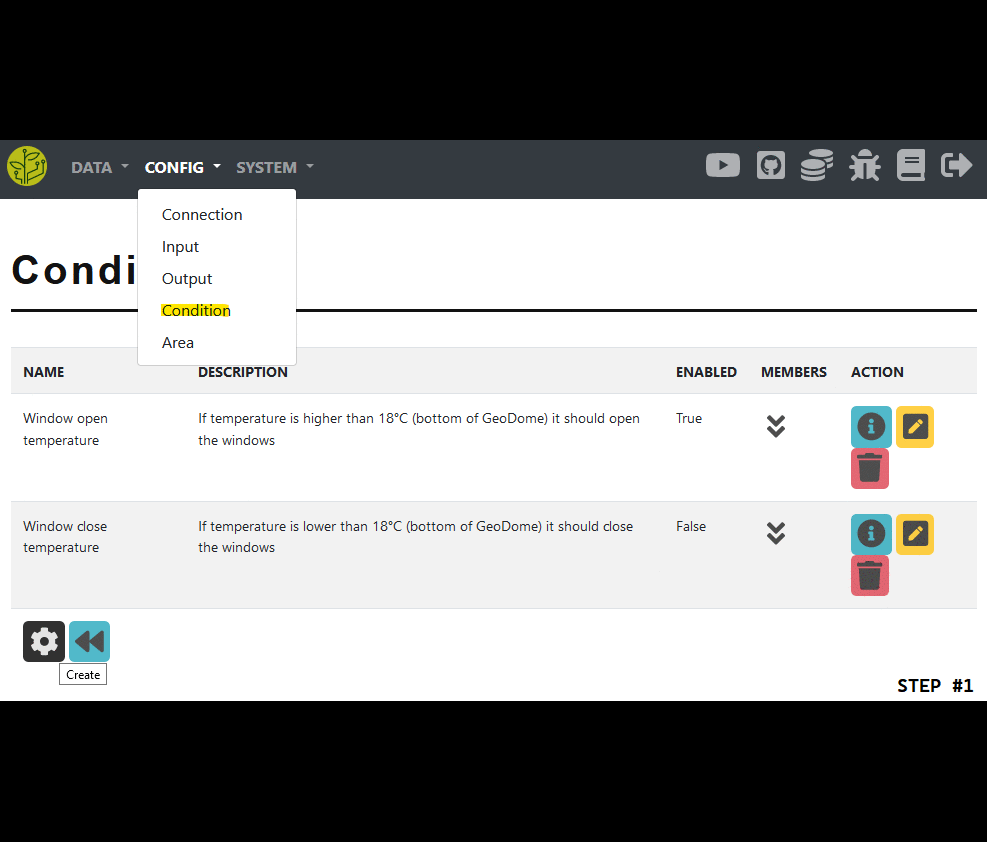
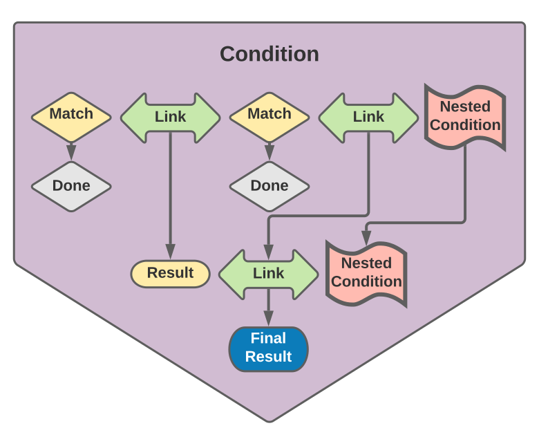

.. _config-condition:

=========
Condition
=========

Description
***********

Conditions are used in the :ref:`output-workflow <workflow-output>`.

They run in a timed loop just like :ref:`input devices <workflow-input>`.

Conditions must be matched before an action is executed or reversed.

A condition **must be linked** at least with an **output device** or an **output model**.

The **matching rules** are connected to the condition via **condition links**.

It can also be **linked to areas**. This will filter the output devices, that would be started, to the ones that are a member of this area.

|condition_basic|

----

Create
******

Here we will go through on how to configure a condition.

Default
=======

We will go through this config with the **following example**:

* There is a window opener actor
* This window should be opened when the (*average*) air temperature is higher than 18°C for 2 hours

Config
------

The **following steps are needed** to configure such a condition:

1. Create the condition

  * Open the condition config website
  * Press the create button at the bottom of the page
  * Enter a name and optionally a description
  * You must choose an interval (*in seconds*) in which to run the conditional check
  * If the condition is enabled its timer will be run

2. Create a link

  * Open the member view by pressing the 'member' button
  * As a member type choose 'condition link' and press the 'create' button
  * Enter a name and choose an operator => you can find more info in the 'info' section below

3. Create a match

  * In the condition link view open the members of the newly created link
  * As a member type choose 'condition match' and press the 'create' button
  * Enter a name and optionally a description
  * You must choose one of the following options as a source for the data

    * Input device => a single device
    * Input model => all devices of a given model (*can be filtered by area*)
    * Special match => some other comparison like time/date/datetime/day_week/day_month

  * Provide a comparison value, operator, check type and period => you can find more info in the 'info' section below

4. Add the match to the link

  * In the condition link view open the members
  * As a member type choose 'condition match' and press the 'add' button
  * Choose an order and the match you want to add

5. Re-check your link config

6. Add the link to the condition

  * In the condition view open the members
  * As a member type choose 'condition link' and press the 'add' button

7. Add an output

  * In the condition view open the members
  * As a member type choose one of the following and press the 'add' button

    * Output device => a single device
    * Output model => all devices of a given model (*can be filtered by area*)

8. Re-check your condition config

|default_condition|

----

.. _config-condition-output:

Reverse
=======

A reverse condition is evaluated when it comes to stopping the actor.

We will go through this config with the **following example**:

* There is a window opener actor
* This window should be closed when the (*average*) air temperature is lower than 18°C for 30 minutes

Config
------

The **following steps are needed** to configure such a condition:

1. Creating the condition itself and its link

  * You must disable it
  * The timer setting can be ignored
  * Create a condition link as showed above in the 'default' section

2. Create a condition match

  * Choose the input device or model to evaluate
  * Set the target value of the match
  * Choose the comparison type and operator
  * Configure the period

3. Add the match to the link

4. Add the link to the condition

5. Edit the existing output model or add a new one

6. Configure the reverse condition

  * Choose the newly created condition
  * Configure the reverse settings as needed

|reverse_condition|

----

Info
****

.. _config-condition-link:

Condition link
==============

Links allow conditions to have complex structures.

They are used to calculate the result of two member-items.

Linking targets
---------------

* two condition matches,
* one match and a nested condition or
* two nested conditions

Processing types
----------------

* **AND** => both members must match
* **NOT-AND** => neither or just one member must match
* **OR** => at least one member must match
* **NOT-OR** => none of the members must match
* **XOR** => only one member must match, the other one must not
* **NOT-XOR** => either both or none of the members must match
* **NOT** => the first one must match, the second one must not

----

.. _config-condition-match:

Condition match
===============

A condition match is a single rule to match.

It will compare data to some given value using an operator.

Sources of data
---------------

* **Input device** => a single sensor device
* **Input model** => all devices of a given sensor model

  * They can be **filtered by an area** => only the devices in the given area will be used for the data selection

* **Special match** => some other comparison like:

  * **time** => comparison with the current **time of the day**
  * **date** => comparison with the **current date**
  * **datetime** => comparison with the **current date and time**
  * **day_week** => comparison with the current **day of the week**
  * **day_month** => comparison with the current **day of the month**

Periods
-------

Periods are used to pull data-points for the match comparison.

There currently are **two types of periods** to use.

* **RANGE** => the last N data-points of the given device(s)
* **TIME** => all data-points in a given time period (*in seconds*)

Check types
-----------

These check types are used to calculate the final data for comparison from the given pool of datapoint pulled from the database.

If the **data type** is **neither integer nor float** those **calculations will be skipped**.

* **AVG** => get the average value
* **MIN** => get the smallest value
* **MAX** => get the largest value

Operators
---------

* **EQUALS** => whether the calculated data is equal to the configured value
* **NOT** => the data must not be equal to the value
* **BIGGER** (*<*) => whether the data is bigger than the value
* **SMALLER** (*>*) => whether the data is smaller than the value
