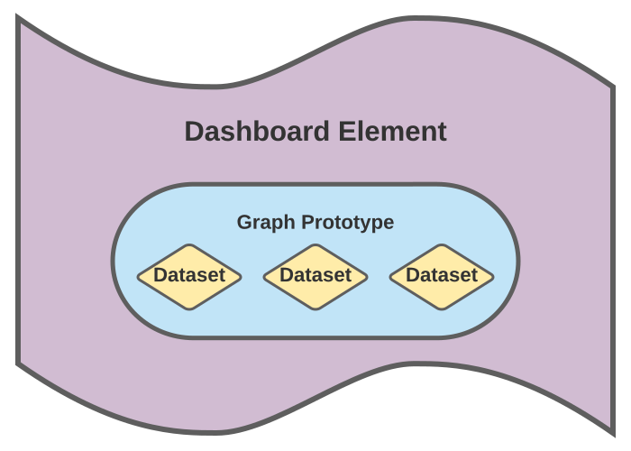

.. _config-dashboard:

=========
Dashboard
=========

.. warning::
   Documentation is not yet finished.

Description
***********
How to configure dashboards in the GrowAutomation webinterface.

Dashboards
**********

How to create a dashboard and configure its grid-system.

Elements
********

|element|

How to create a dashboard element.

Graphs
======

How to create a graph prototype.

Datasets
========

How to create a dataset.
