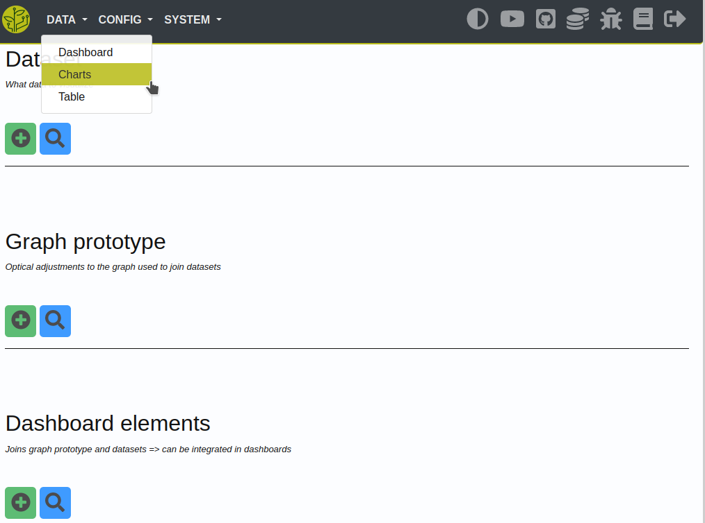

.. _config-dashboard:

.. |element| image:: ../_static/img/config/dashboard/element.svg
   :class: ga-img-basic ga-img-center

.. include:: ../includes/tip_links.rst

=========
Dashboard
=========

Description
***********
How to configure dashboards in the GrowAutomation webinterface.

Elements
********

Dashboard elements can be added to dashboards.

You have to configure it using the 'Data - Charts' site.

|charts|

They are built of 'datasets' and 'graphs'.

|element|

Graphs
======

A 'graph' defines some basic settings for the dashboard-element.

Per example:

* time/date formats

* x/y axis settings

* chart.js custom configuration

* data unit

Datasets
========

A 'dataset' is used to configure what data will be displayed.

You have to set:

* an input-device

* some data-range

* a data-function (*minimum, average, maximum*)

* visual settings

Dashboards
**********

After creating your dashboard-elements you can add them to a dashboard.

To do that you first have to create a dashboard.

You can do this by choosing 'Create' on the site 'Data - Dashboard' and clicking on the 'Select' button.

|db_create|

Give the dashboard a name and set the size of the dashboard (*row times columns*) and click on 'Save'.

You now can see a preview of your new dashboard.

At the bottom you can add elements to the dashboard and choose their size and position.

|db_add|

You then can verify the looks of it in the preview and modify it if needed.

|db_preview|
