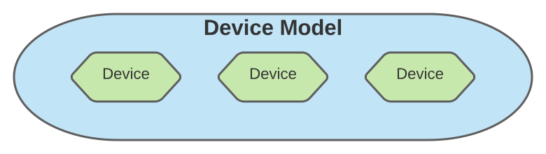
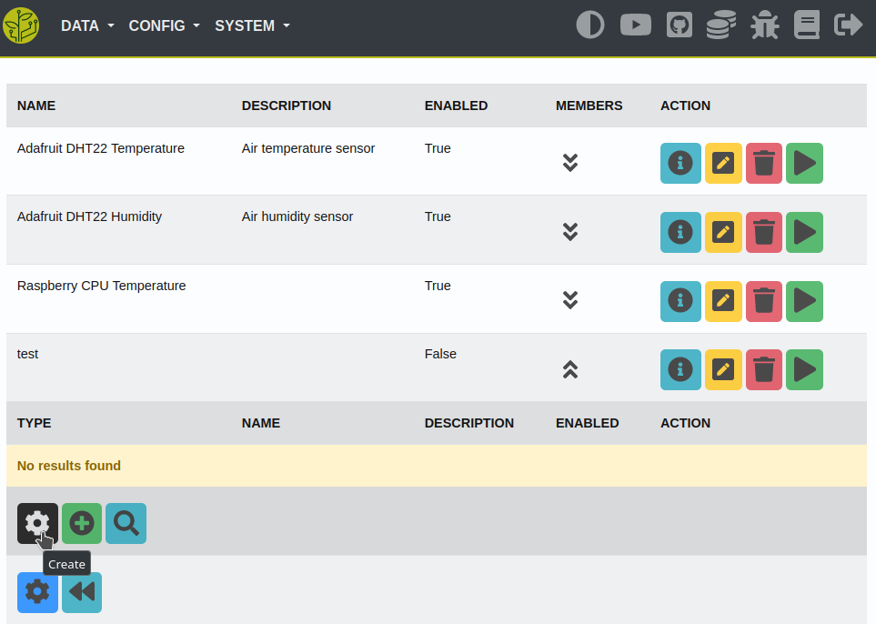
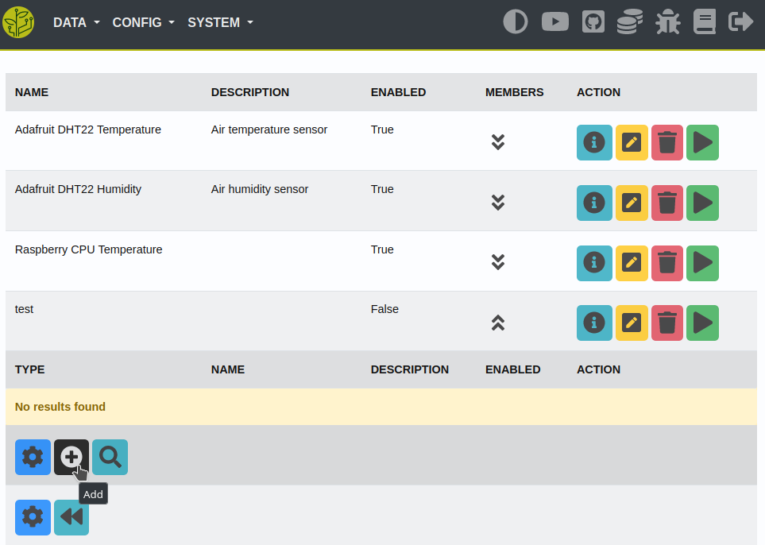
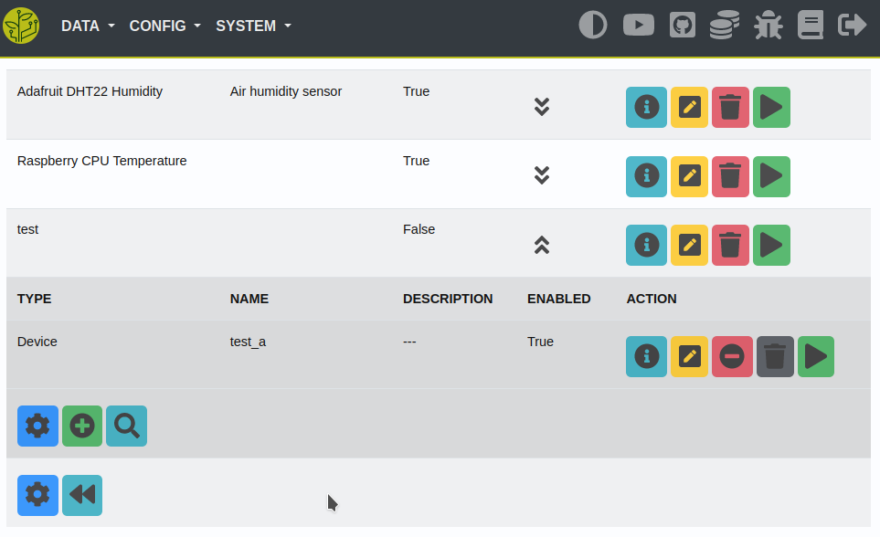
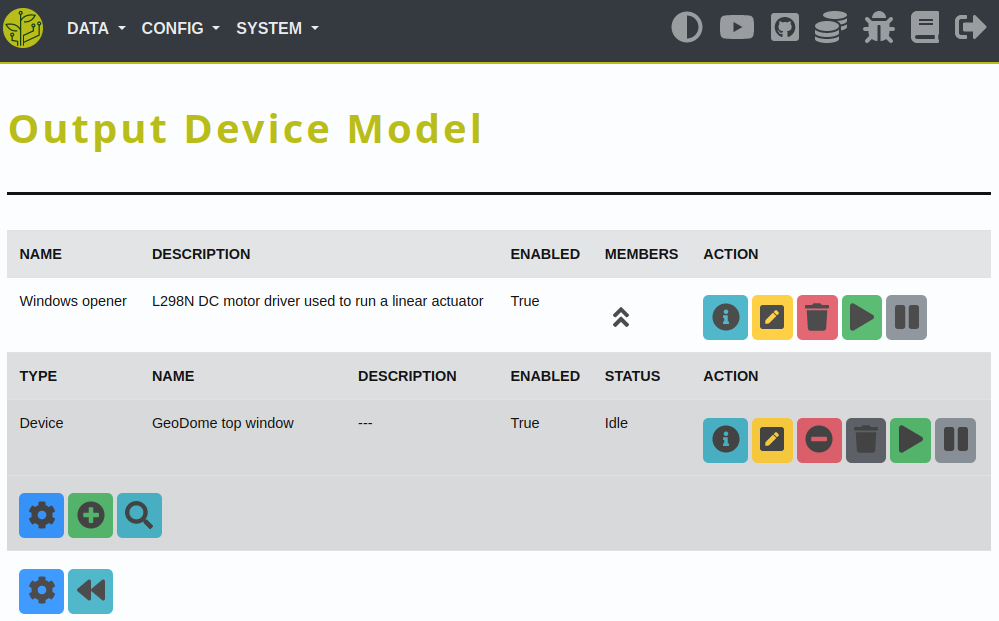

.. _config-device:

.. include:: ../includes/tip_links.rst

======
Device
======

Description
***********
How to configure sensors for the input-workflow.

----

Basic
*****

How the basic device config is structured.

Model
-----

**Device models** are used to group devices of the **same hardware-type**.

|model|

Settings that are shared across all devices of this type are set for the model.

Those settings are inherited by the devices. A device can only be a member/child of one model!

Some settings can be defined on a model- and device-basis. If a setting is defined in both - the **device config will be prioritized**.

You always have to **create the device-model first** - before you can create devices of its type. This can be done on the site 'Config - Input' or whatever device-type you want to create (*Input/Output/Connection*). Just press the 'Create' button at the bottom of the site.

Device
------

After you created the device-model - you can create your devices.

Open the model-members section and press the 'Create' button shown in it:

|device_create|

Fill the form-data and press the 'Save' button.

After that you can add the device as a member of the model:

|device_add|

It should look like this when you've finished you configuration:

|device_finished|

----

Output
******

:ref:`What are output devices <device-output>`

Output devices have some additional settings. Actors can be reversible - therefore you are able to set some 'reverse-settings'.

Also you can see the status of your actors on the site 'Config - Output':

|output|
