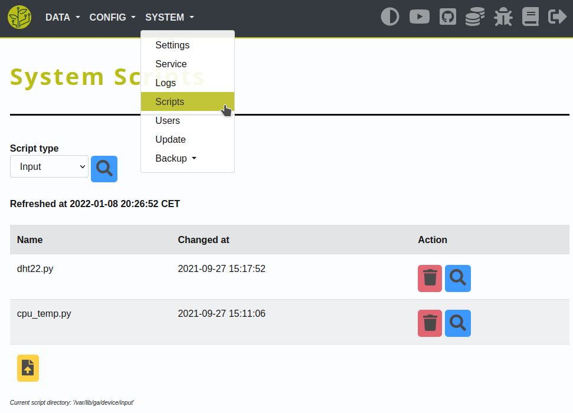

.. _config-script:

.. include:: ../includes/tip_links.rst

======
Script
======

Description
***********
How to add and manage custom scripts.

Manage
******

The 'System - Scripts' site allows you to:

* list existing scripts

* delete existing scripts

* show/read the content of existing scripts

* upload new scripts and/or update existing ones

|list|

Writing scripts
***************

How your own scripts can be integrated into the GrowAutomation core.

Basics
======

Binary
------

You are able to run your script with any given binary so that you can use your favorite scripting/programming language.

It's also possible to just run a binary and leave the script empty - in case you want to use compiled code.

Either way - the script/binary will be expected in the device-script directories.

Script directories
------------------

With the default config, the directories are the following:

.. code-block:: none

  /var/lib/ga/device/input
  /var/lib/ga/device/output
  /var/lib/ga/device/connection

Data output
===========

When using a script for an input-device you must return some data to the core.

This is done by simply writing it to STDOUT. In Python you can just 'print' it.

The core will expect the output to be formatted as JSON with the key 'data'.

Per example:

.. code-block:: bash

  python3 cpu_temp.py
  > {"data": "12.60"}

In python3 it can be done like this:

.. code-block:: python3

  from json import dumps as json_dumps

  output = get_data()
  output_dict = {'data': output}
  print(json_dumps(output_dict))

Receiving config
================

There are basically two ways your script can receive configuration from the GrowAutomation core.

Script arguments
----------------

If you need a:

* simple 'switch' argument

* that is shared across all of the devices of a type/model

You can use a **script argument**.

This argument is passed as-is to the script as argument #1.

Per example:

.. code-block:: none

  # configured script: 'dht22.py'
  # configured argument: 'temperature'

  # command to be executed by the core:
  python3 dht22.py temperature

If you use an **output-device** that can be reversed - it is also possible to set a specific **reverse argument**!

Per example:

.. code-block:: none

  # configured script: 'L298N.py'
  # configured argument: 'forward'
  # configured reverse-argument: 'reverse'

  # command to be executed by the core to activate the actor:
  python3 L298N.py forward

  # command to be executed to stop the actor:
  python3 L298N.py reverse

Device connection
-----------------

Whenever you need to pass:

* more settings

* device-specific settings

You can use the **device-connection** setting.

This setting can either hold one **single value** or **key-value pairs** and will be passed in JSON-format to the script.

Single value
^^^^^^^^^^^^

Per example:

.. code-block:: none

  # configured script: 'dht22.py'
  # configured argument: 'temperature'
  # configured device-connection: '4'

  # command to be executed by the core:
  python3 dht22.py temperature "{\"connection\": 4}"

Key-Value pairs
^^^^^^^^^^^^^^^

Per example:

.. code-block:: none

  # configured script: 'L298N.py'
  # configured argument: 'forward'
  # configured reverse-argument: 'reverse'
  # configured device-connection: 'ga_json[fwd=19,rev=26,time=20]'

  # command to be executed by the core to activate the actor:
  python3 L298N.py forward "{\"connection\": {\"fwd\": \"19\", \"rev\": \"26\", \"time\": \"20\"}}"

  # command to be executed to stop the actor:
  python3 L298N.py reverse "{\"connection\": {\"fwd\": \"19\", \"rev\": \"26\", \"time\": \"20\"}}"

The script can then load that config - in python3 it can be done like this:

.. code-block:: python3

  from sys import argv as sys_argv
  from json import dumps as json_loads

  CONFIG = json_loads(sys_argv[2])
  get_data(CONFIG['my_setting'])
