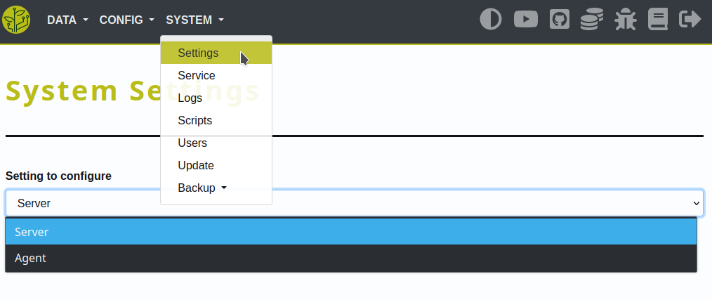

.. _config-system:

.. include:: ../includes/tip_links.rst

======
System
======

Description
***********

System settings are used to define configure fundamental functions.

Those settings are split-up in two types - 'Server' and 'Agent'.

This is because in the future it will be possible to connect multiple agents to one server.

|settings|

Server
******

The server-settings are set for the website - you use to interact with the GrowAutomation software.

Most of these settings are related to the webinterface itself.

Agent
*****

The agent-settings are set for the GrowAutomation core - that is processing your devices.

Here you find settings related to the core service.

