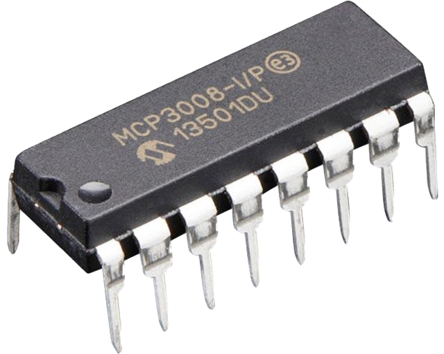
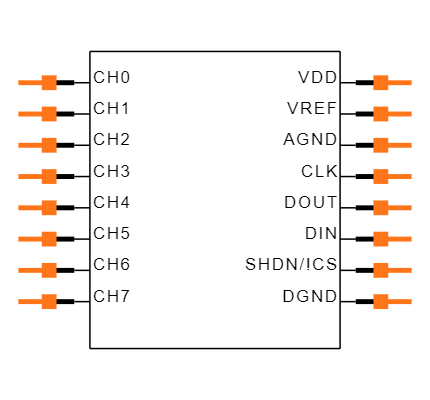

.. _device-connection:

.. |ads1115| image:: ../_static/img/devices/connection/ads1115.jpg
   :class: ga-img-right-small

.. include:: ../includes/tip_links.rst

==========
Connection
==========

Description
***********
Here you can find information to the implementation and maintenance of connection-devices such as analog to digital converters.

.. note::
   Only devices we tested are listed here.

   If you have tested some on your own and want to contribute your know-how => send us the information to contact@growautomation.eu

   Please include at least the information you see listed in the existing devices below.

----

Devices
*******

ADS1115
=======

|ads1115|

Tags
----

* **NATIVE**
* **SOLDERING**
* **3.3V**
* **4 INPUTS**
* **2 GPIO**

Links
-----

* `Adafruit tutorial for i2c <https://learn.adafruit.com/circuitpython-basics-i2c-and-spi/i2c-devices>`_
* `Adafruit tutorial for ads1x15 <https://learn.adafruit.com/adafruit-4-channel-adc-breakouts/python-circuitpython>`_
* `Amazon 'ads1115' <https://www.amazon.de/AZDelivery-ADS1115-Channels-Arduino-Raspberry/dp/B07TY3TSBG>`_

Dependencies
------------

* **apt**

  * python3-smbus
  * i2c-tools

* **pip**

  * adafruit-circuitpython-ads1x15

* **privileges**

  * executing user must be a member of:

    * group **gpio** (*usermod -a -G gpio USERNAME*)
    * group **i2c** (*usermod -a -G i2c USERNAME*)

* **raspi-config**

  * i2c must be enabled (*raspi-config nonint do_i2c 0*)

Config
------

Device model
^^^^^^^^^^^^

* Script: ads1115.py

Device
^^^^^^

* Connection:

  * If empty => the default i2c will be used
  * Else => ga_json[scl=GPIO_PIN,sda=GPIO_PIN]

Implementation
--------------

You will have to solder the pins to the `pcb <https://en.wikipedia.org/wiki/Printed_circuit_board>`_.

GA supports this converter natively.

Wiring
^^^^^^
See also: `raspberry pi i2c pinout <https://pinout.xyz/pinout/i2c>`_

**Power**

* VDD => 5V power supply
* GND => ground

**Connections to raspberry**

* SDA => GPIO #0, #2 or any free default gpio
* SCL => GPIO #1, #3 or any free default gpio

**Connections to analogue sensors**

* A0 to A3 => analogue out of the sensor

Issues
------

The contacts are sensitive to corrosion.

You would want to seal it by covering it with epoxy resin.

----

MCP3008
=======

|mcp3008|

Tags
----

* **NATIVE**
* **3.3V**
* **8 INPUTS**
* **4 GPIO**

Links
-----

* `Adafruit tutorial for spi <https://learn.adafruit.com/circuitpython-basics-i2c-and-spi/spi-devices>`_
* `Adafruit tutorial for mcp3xxx <https://learn.adafruit.com/mcp3008-spi-adc/python-circuitpython>`_
* `Amazon 'mcp3008' <https://www.amazon.de/Adafruit-MCP3008-856-Konverter-Schnittstelle/dp/B00NAY3RB2>`_

Dependencies
------------

* **apt**

  * python3-smbus

* **pip**

  * adafruit-circuitpython-mcp3xxx

* **privileges**

  * executing user must be a member of:

    * group **gpio** (*usermod -a -G gpio USERNAME*)
    * group **spi** (*usermod -a -G spi USERNAME*)

* **raspi-config**

  * spi must be enabled (*raspi-config nonint do_spi 0*)

Config
------

Device model
^^^^^^^^^^^^

* Script: mcp3008.py
* Script argument: spi number

  * If empty => the default spi will be used

Device
^^^^^^

* Connection: GPIO_PIN

Implementation
--------------

GA supports this converter natively.

Wiring
^^^^^^

|mcp3008_pin|

See also: `raspberry pi spi pinout <https://pinout.xyz/pinout/spi>`_

**Power**

* VDD => 3.3V power supply
* VREF => 3.3V power supply
* AGND => ground
* DGND => ground

**Connections to raspberry**

* CLK => GPIO #11 or #21
* CS => any free default gpio-pin
* DIN => GPIO #9 or # 19
* DOUT => GPIO #10 or #20

**Connections to analogue sensors**

* CH0 to CH7 => analogue out of the sensor

Issues
------

Multiple spi-clients per bus were not successfully tested yet (*spi would support it when using a cs-pin per client-device* => see `per example <https://raspberrypi.stackexchange.com/questions/71448/how-to-connect-multiple-spi-devices-adcs-to-raspberry-pi>`_)
