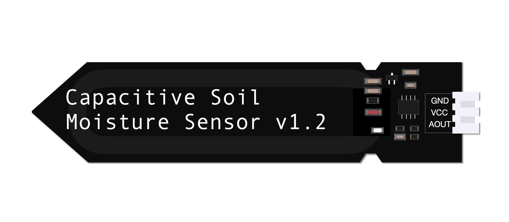
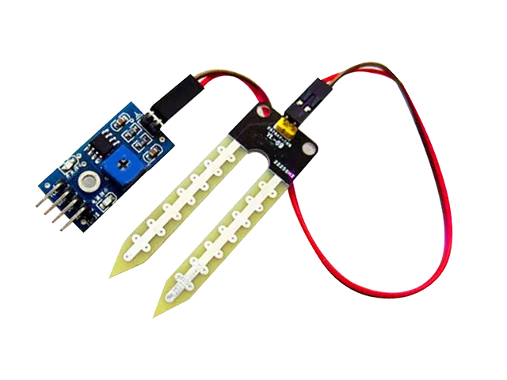
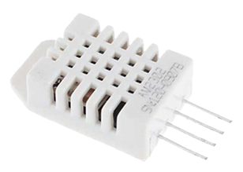
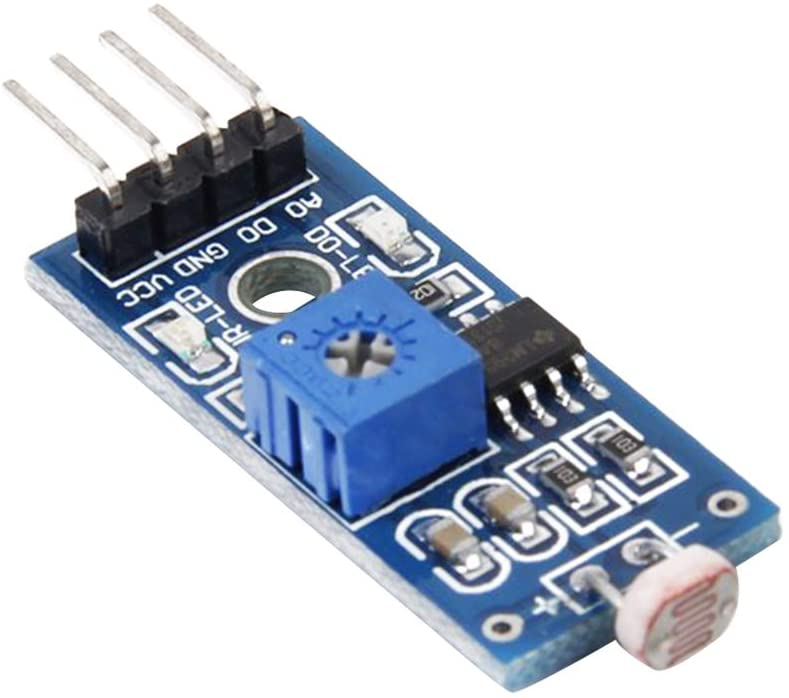

.. _device-input:

=====
Input
=====

Description
***********
Here you can find information to the implementation and maintenance of sensors.

.. note::
   Only sensors we tested are listed here.

   If you have tested some on your own and want to contribute your know-how => send us the information to contact@growautomation.eu

   Please include at least the information you see listed in the existing devices below.

----

Devices
*******

DHT22/AM2302 air temperature and humidity sensor
================================================

|dht22|

Tags
----

* **NATIVE**
* **DIGITAL**
* **3.3V**
* **1 GPIO**

Links
-----

* `Adafruit tutorial <https://learn.adafruit.com/dht/dht-circuitpython-code>`_
* `Amazon 'dht22' <https://www.amazon.de/-/en/AZDelivery-AM2302-Temperature-Sensor-Humidity/dp/B074MZSZYF>`_

Dependencies
------------

* **apt**

  * libgpiod2

* **pip**

  * adafruit-circuitpython-dht

* **privileges**

  * executing user must be a member of group **gpio** (*usermod -a -G gpio USERNAME*)

Implementation
--------------

This is a digital sensor.

You can connect it to a raspberry gpio port and configure the input-device accordingly.

GA supports this sensor natively.

Wiring
^^^^^^

Pin counting from left to right (*as seen on the picture*)

**Power**

* PIN1 => 3.3V power supply
* PIN4 => ground

**Connections to raspberry**

* PIN2 => any free default gpio

Issues
------

No known issues.

----

Capacitive soil humidity sensor
===============================

|soil_moisture_capacitive|

Tags
----

* **ANALOGUE**
* **5V**
* **1 ADC PORT**

Links
-----

* `Detailed information <https://thecavepearlproject.org/2020/10/27/hacking-a-capacitive-soil-moisture-sensor-for-frequency-output/>`_
* `Amazon 'soil humidity sensor' <https://www.amazon.de/-/en/AZDelivery-Hygrometer-Capacitive-Compatible-Including/dp/B07V6M5C4H>`_

Dependencies
------------

* analogue to digital converter

Implementation
--------------

This ia a analogue sensor.

You need to connect it via a :ref:`connection-device <device-connection>` .

Wiring
^^^^^^

**Power**

* VCC => 5V power supply
* GND => ground

**Connections to converter**

* AOUT => any free analogue in port

Issues
------

The sensor `pcb <https://en.wikipedia.org/wiki/Printed_circuit_board>`_ will absorb water => you would want to seal its edges with epoxy resin.

Also the electronic components soldered to the sensor should be protected from moisture by using epoxy resin or a heat-shrink tubing.

You can find a good pictured tutorial of how to do this `here <https://thecavepearlproject.org/2020/10/27/hacking-a-capacitive-soil-moisture-sensor-for-frequency-output/>`_.

----

Photo-resistor light sensor
===========================

|light_photo_resistance|

Tags
----

* **ANALOGUE**
* **3.3V**
* **1 ADC PORT**

Links
-----

* `Amazon 'photo resistor light sensor' <https://www.amazon.de/-/en/gp/product/B07P6XBH34>`_

Dependencies
------------

* analogue to digital converter

Implementation
--------------

This sensor has only a rudimentary digit output. For better readings the analogue output should be used.

Therefore you need to connect it via a :ref:`connection-device <device-connection>` .

Wiring
^^^^^^

**Power**

* VCC => 3.3V power supply
* GND => ground

**Connections to converter**

* A0 => any free analogue in port

Issues
------

No known issues.

----

Resistance soil humidity sensor
===============================

|soil_moisture_resistance|

Tags
----

* **NOT RECOMMENDED**
* **ANALOGUE**
* **5V**

Links
-----

* `Amazon 'soil hygrometer sensor' <https://www.amazon.de/AZDelivery-moisture-hygrometer-modules-Arduino/dp/B07V4KXZ35>`_

Dependencies
------------

* analogue to digital converter

Implementation
--------------

This sensor has only a rudimentary digit output. For better readings the analogue output should be used.

Therefore you need to connect it via a :ref:`connection-device <device-connection>` .

Wiring
^^^^^^

**Power**

* VCC => 3.3V power supply
* GND => ground

**Connections to converter**

* A0 => any free analogue in port

Issues
------

**NOT RECOMMENDED**

**It will break down after some time because of oxidation**. Releasing unsafe substances.

**You could**:

Turn on the energy supply to the sensor only at the moment you want to read its measurement (*per example with a relay*). This would slow the electrolysis down.
