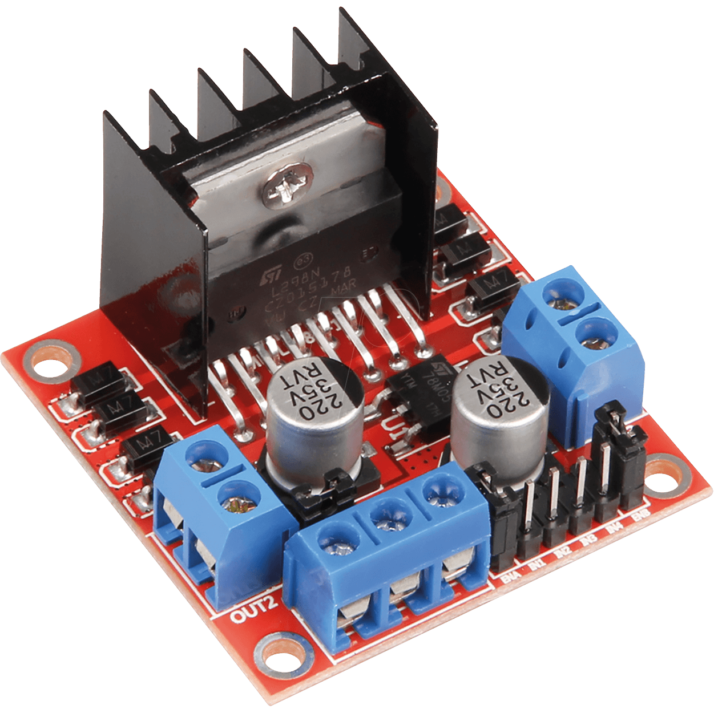
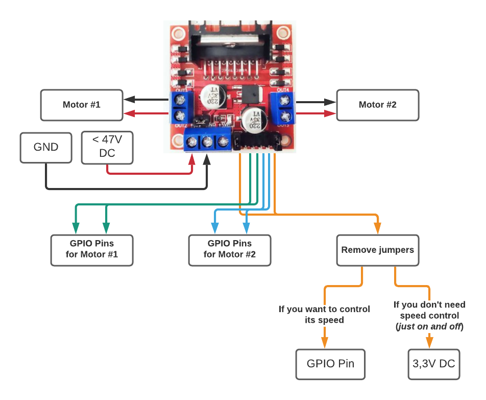

.. _device-output:

======
Output
======

Description
***********

Here you can find information to the implementation and maintenance of output-devices.

.. note::
   Only devices we tested are listed here.

   If you have tested some on your own and want to contribute your know-how => send us the information to contact@growautomation.eu

   Please include at least the information you see listed in the existing devices below.

.. warning::
   Documentation is not yet finished.

----

Devices
*******

L298N Motor driver
==================

A bi-directional (*forward and reverse*) motor driver.

Can per example be used for:

* Windows openers => using a `linear actuator <https://en.wikipedia.org/wiki/Linear_actuator>`_

|l298n|

Tags
----

* **NATIVE**
* **up to 46V**
* **2 Motors**
* **2-6 GPIO** (*3 per motor if you want to control its speed; else 2*)

Links
-----

* `Amazon 'L298N' <https://www.amazon.de/ARCELI-Controller-Module-Bridge-Arduino/dp/B07MY33PC9>`_
* `Amazon 'Linear Actuator' <https://www.amazon.de/gp/product/B07DXS8DBJ>`_ (*window opener*)

Dependencies
------------

* **privileges**

  * executing user must be a member of:

    * group **gpio** (*usermod -a -G gpio USERNAME*)

Implementation
--------------

The 'IN' pins are used to check in which direction the motor should be turned.

Their voltage is compared to the one applied to the 'EN' pin to get the output voltage:

OUTPUT-VOLTAGE = INPUT-VOLTAGE * ( INx-VOLTAGE / ENx-VOLTAGE )

Wiring
^^^^^^

|l298n_wiring|

**Power**

* VDD => 12V power supply (*or any other voltage you need, as long as it is lower than 47V*)
* GND => ground

**Connections to raspberry**

* IN1-IN4 => any free default gpio pin
* ENA/ENB

  * remove jumpers
  * If you want to control the motor speed => connect to any free default gpio pin
  * Else => connect to 3.3V DC

Issues
------

Should be protected from high air humidity.

Else the driver will corrode over time!

If that is not possible => you would want to seal it by covering it with epoxy resin.
