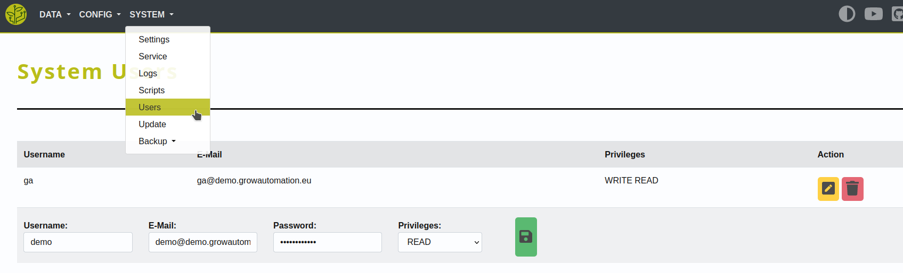

.. _setup-post-setup:

.. include:: ../includes/tip_links.rst

=============
6. Post-Setup
=============

Description
***********

Here we will go through the tasks you need to perform :ref:`after the installation <setup-setup>` per **script or image**.

Basic tasks
***********

1. You will have to connect to the device using ssh!

  Look into the :ref:`find <setup-find>` and :ref:`connect guide <setup-connect>` on how to do that.

  If you have used the installation image the password to connect should be: **Gr0w21736!**

2. If you have used the installation image - you should run the password randomization script:

  .. code-block:: bash

    sudo bash /var/lib/ga/setup/randomize_pwds.sh

3. You need to retrieve your passwords:

  .. code-block:: bash

    sudo cat /etc/.ga_setup
    # after that you should remove the password file
    sudo rm /etc/.ga_setup

4. Login into the web user-interface using the retrieved password:

  Open the URL https://${IP} - in which '${IP}' is the address you found using the :ref:`find guide <setup-find>`

5. You can now manage the users using the 'System - Users' site.

  |users|

6. Now you can configure your devices and start using the GrowAutomation software!

  More information to the configuration can be found :ref:`here <config-device>`.