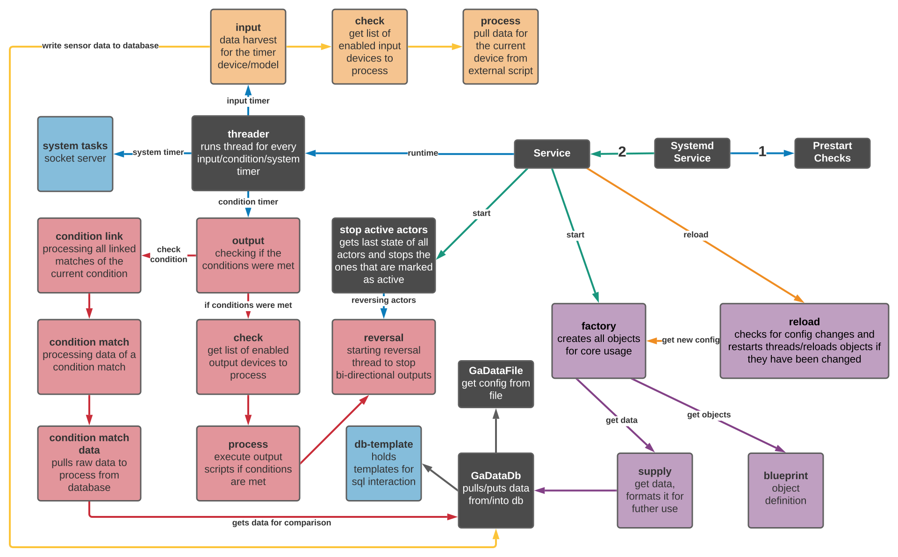

.. _workflow-detailed:

.. |factory| image:: ../_static/img/workflow/basic/factory.svg
   :width: 100%

========
Detailed
========

Description
***********
Overview of the detailed workflow used in the GrowAutomation core.

This workflow is relatively complex and **you don't need to know it as a user**.

This information is for developers and diy-enthusiasts that want to extend or troubleshoot it.

Core
****

This workflow is responsible for the core functionalities of GrowAutomation.

Visualization
=============
|core|

----

Factory
*******

This is not really a workflow.

It shows the objects used for config-management by the core modules.

Visualization
=============
|factory|
